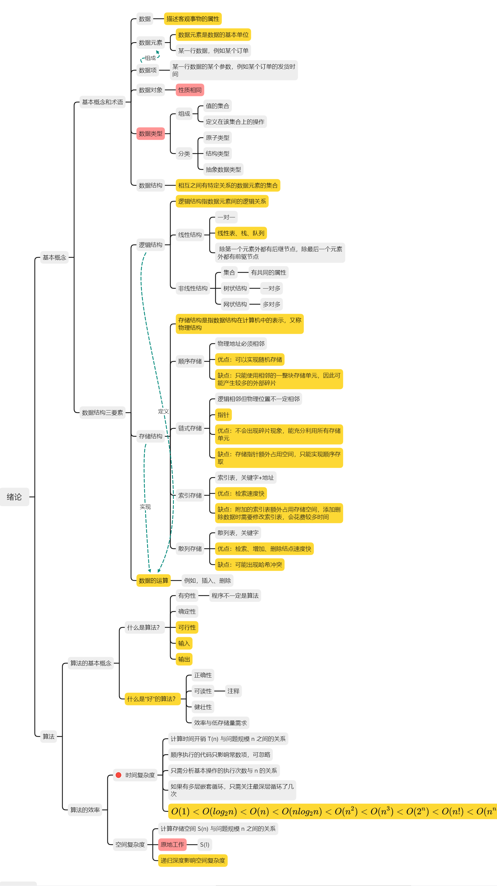

# Lesterの第五周

> People have all kinds of sides, meimei, and some sides are messy. The point isn't to push the bad things away, it's to make room for it, live with it. ——《Turning Red》

&emsp;&emsp;今天是4月3日，考研复习进行五周了，据考研还有264天。

&emsp;&emsp;这周的高数主要学习了一些微积分的应用、多元函数积分学、三重积分、第一二型曲线曲面积分等知识，目前感觉第十八讲的知识可能在计算量、方法和画图上比较难，尤其是画图，很多截面图我都不太会画，比如锥面截柱面、抛物面截柱面等。

&emsp;&emsp;到目前为止，高数的基础部分的课程都已经结束了，但是我觉得现在还没有必要进入线代第一轮的复习（虽然身边很多人已经开始线代的复习了），我觉得高数学到后面很多前面的公式定理都记得不是很清楚了，感觉一方面是题目做的太少了，课程只是带你入门，真正的理解、消化、再到应用应该是在自己做题、整理、总结的过程中得来的。高数的基础阶段我觉得应该还需要自己再加强一下：把 30 讲的例题再重新自己动手完整地做一遍、每一讲自己默写一下基础知识结构、重点的公式定理自己再推导一遍、重点的计算部分（极限、微分、积分等）再找一些题目系统地训练和总结归纳方法。希望能在两周内完成这些，4 月18日之前进入线代部分的学习，加油💪！

&emsp;&emsp;这周的英语感觉都没怎么搞，我反思了下原因，一方面是疫情封校，在寝室每天早上起来的都特别晚，单词也就没怎么背了；另一方面还是自己主观上不够自律，没有很好地约束自己，在寝室就很难高效率地学习了。好想念我的图书馆啊，两周不见，可想死你了，疫情赶快gun吧，好想回到图书馆，回到正常生活。

&emsp;&emsp;这周陆续开始专业课的复习啦，首先便是数据结构。随着专业课加入复习的进程，复习也变得没那么乏味，之前一天到晚做高数也太难受了。之前几乎每天早上到图书馆，效率巨高，高数猛搞一通，下午就有点乏味了，晚上就再也不想看高数了，第二天循环往复。那句话叫什么来着，高数虐我千百遍，我待高数如初恋。其实没有千百遍，也就每天晚上做高数的时候就很想吐😄。回到数据结构，目前想的是先把王道过一轮，然后再根据目标院校进行强化。这周数据结构学了第一章绪论，内容相对比较简单，但题目是真的不好做，一些最基础的概念题错漏百出，像相对难一点的时间复杂度、空间复杂度的分析反倒还好。408专业课的知识比较多，前面学后面忘应该会是常态，所以，我觉得代码实现 + 思维导图 + 经常复盘，应该是相对比较好的策略。基本的数据结构、操作系统的重要管理算法、计网的一些协议都需要自己动手实现一遍，感觉书本上的知识学了可能会忘，自己实现了代码才是真正理解了原理，我相信理解了原理之后即使忘记也能很快捡回来。思维导图主要是让知识系统化，结构化，在心中能有一个比较清楚的知识结构。虽然王道也做了很多的思维导图，但我觉得思维导图这个东西需要自己学完一章之后自己默写一份，然后再对照书本和王道进行完善，这样效果才最好，下面是我自己做的第一章的思维导图。

复盘就不用说了，克服遗忘 yyds 的方法。

&emsp;&emsp;服创快要进入尾声了，后面几周应该会投入大量的时间进行服创的收尾工作，具体包括文档的撰写、系统的优化、算法的调优、PPT 制作、项目简介视频制作等。

&emsp;&emsp;这周我抽时间观看了《青春变形记》（《Turning Red》 ）。不要问我为什么总是看动画电影，其实我本人是比较喜欢悬疑推理系列的，尤其是阿婆的作品，阿婆（阿加莎 · 克里斯蒂）的很多经典作品我都看过原著，但是学高数本身就已经很累了，看电影就是想放松一下，再看这种烧脑的就不太合适；反之，轻松搞笑的动画电影就是我在学习之余缓解压力的一剂良药。Pixar 的动画电影还是一如既往的高质量，记得上次看还是《心灵奇旅》和《寻梦环游记》，这次的《青春变形记》也带给了我很多，有一说一，那个 Red Panda 是真的超 cute，太喜欢啦 。故事讲述的是13岁的亚裔主人公 meimei 在一场意外之中变成了一只红熊猫，进而揭开了关于她家族的秘密。整部电影的气氛轻松愉悦，探讨的主题是青春成长与代际关系，故事中的 meimei 很能让我产生共情，meimei 的妈妈和我的妈妈也很像，青春期的我们和父母之间微妙的关系、母亲对子女的高期待、与子女之间的 gap ，来自青春期真实的人物、真实的情感、真实的烦恼让整部电影笑中带泪，显得格外动人。豆瓣中有个评论我觉得写的特别好：”**变红一语双关，既指变身红色小熊猫，也指女孩情窦初开青春初潮，变红是对自我的探索，也是对压抑的反抗，这一主题无疑是对千百年古老东方神话的延续，从织女到小倩再到美美，叛逆女孩与完美老妈终有一战。或许也正是这一战，让女孩成为女人，让她懂得你也是曾经的我，我将长成未来的你，一如她牵着妈妈的手从少年走向成人。女同胞们，记住在成为女儿、妻子、母亲之前，你是女人，骄傲地做自己吧，因为你的熊猫（身体），你的选择。**“

&emsp;&emsp;最后，用电影中的一句台词作为本篇的结语：”**This is me！**“

**本周小结**：

* 张宇基础30讲及300题：第十五讲、第十七讲、第十八讲
* 英语单词闪过：word list 13
* 《王道数据结构》第一章
* 观看《青春变形记》
* 服创继续肝
